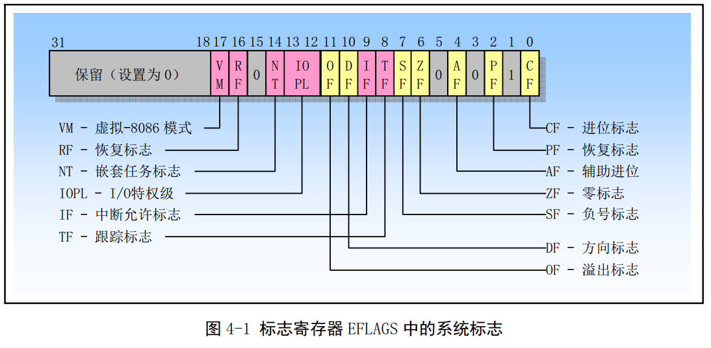
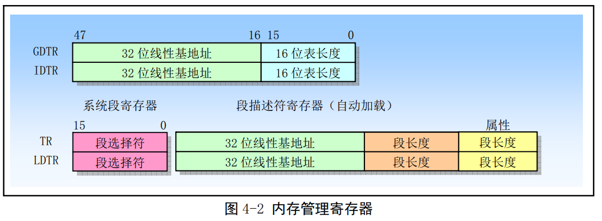
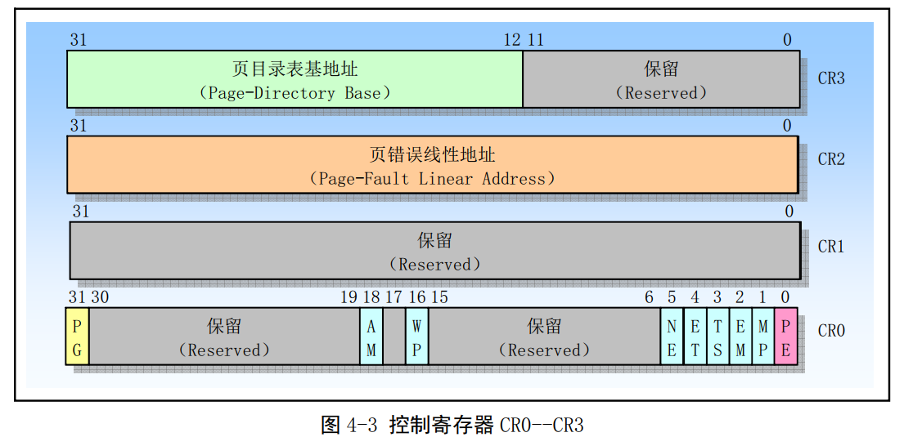

# x86寄存器介绍和系统指令介绍.md

## 标志寄存器

标志寄存器EFLAGS中的系统标志和IOPL字段用于控制I/O访问、可屏蔽硬件中断、调试、任务切换以及虚拟-8086模式。通常只允许操作系统代码有权修改这些标志。EFLAGS中的其他标志是一些通用标志(进位CF、奇偶PF、辅助进位AF、零标志ZF、负号SF、方向DF、溢出OF)。

## 内存管理寄存器

处理器提供了4个内存管理寄存器(GDTR、LDTR、IDTR 和TR)，用于指定分段内存管理所使用的系统表的基地址，见图4-2所示。处理器为这些寄存器的加载和保存提供了特定的指令。

GDTR、LDTR、IDTR和TR都是段基址寄存器，这些段中含有分段机制的重要信息表。GDTR、IDTR和LDTR用于寻址存放描述符表的段。TR用于寻址-一个特殊的任务状态段TSS (Task State Segment)。TSS段中包含着当前执行任务的重要信息。

### 1. 全局描述符表寄存器GDTR
GDTR寄存器中用于存放全局描述符表GDT的32位线性基地址和16位表长度值。基地址指定GDT表中字节0在线性地址空间中的地址，表长度指明GDT表的字节长度值。指令LGDT和SGDT分别用于加载和保存GDTR寄存器的内容。在机器刚加电或处理器复位后，基地址被默认地设置为0，而长度值被设置成0xFFFF。在保护模式初始化过程中必须给GDTR加载一个新值。

### 2.中断描述符表寄存器IDTR.
与GDTR的作用类似,IDTR寄存器用于存放中断描述符表IDT的32位线性基地址和16位表长度值。指令LIDT和SIDT分别用于加载和保存IDTR寄存器的内容。在机器刚加电或处理器复位后，基地址被默认地设置为0，而长度值被设置成0xFFFF。

### 3.局部描述符表寄存器LDTR
LDTR寄存器中用于存放局部描述符表LDT的32位线性基地址、16 位段限长和描述符属性值。指令LLDT和SLDT分别用于加载和保存LDTR寄存器的段描述符部分。包含LDT表的段必须在GDT表中有一个段描述符项。当使用LLDT指令把含有LDT表段的选择符加载进LDTR时，LDT段描述符的段基地址、段限长度以及描述符属性会被自动地加载到LDTR中。当进行任务切换时，处理器会把新任务LDT的段选择符和段描述符自动地加载进LDTR中。在机器加电或处理器复位后，段选择符和基地址被默认地设置为0，而段长度被设置成0xFFFF。

### 4.任务寄存器TR
TR寄存器用于存放当前任务TSS段的16位段选择符、32位基地址、16 位段长度和描述符属性值。它引用GDT表中的一个TSS类型的描述符。指令LTR和STR分别用于加载和保存TR寄存器的段选择符部分。当使用LTR指令把选择符加载进任务寄存器时，TSS描述符中的段基地址、段限长度以及描述符属性会被自动地加载到任务寄存器中。当执行任务切换时，处理器会把新任务TSS的段选择符和段描述符自动地加载进任务寄存器TR中。

## 控制寄存器
控制寄存器(CR0、CR1、CR2和CR3)用于控制和确定处理器的操作模式以及当前执行任务的特性。CRO中含有控制处理器操作模式和状态的系统控制标志;CR1保留不用;CR2含有导致页错误的线性地址.CR3中含有页目录表物理内存基地址,因此该寄存器也被称为页目录基地址寄存器PDBR(Page-Directory Base address Register)。

### 1.CRO中协处理器控制位
CR0的4个比特位:扩展类型位ET、任务切换位TS、仿真位EM和数学存在位MP用于控制80X86浮点(数学)协处理器的操作。有关协处理器的详细说明请参见第11章内容。CR0的ET位(标志)用于选择与协处理器进行通信所使用的协议，即指明系统中使用的是80387还是80287协处理器。TS、MP和EM位用于确定浮点指令或WAIT指令是否应该产生一个设备不存在DNA(DeviceNotAvailable)异常。这个异常可用来仅为使用浮点运算的任务保存和恢复浮点寄存器。对于没有使用浮点运算的任务，这样做可以加快它们之间的切换操作。

### 2. CRO 中保护控制位

#### PE
CR0的位0是启用保护( Protection Enable)标志。当设置该位时即开启了保护模式;当复位时即进入实地址模式。这个标志仅开启段级保护，而并没有启用分页机制。若要启用分页机制，那么PE和PG标志都要置位。

#### PG
CR0的位31是分页(Paging)标志。当设置该位时即开启了分页机制;当复位时则禁止分页机制,.此时所有线性地址等同于物理地址。在开启这个标志之前必须已经或者同时开启PE标志。即若要启用分页机制，那么PE和PG标志都要置位。

#### WP
对于Intel 80486或以上的CPU, CR0的位16是写保护(Write Proctect)标志。当设置该标志时，处理器会禁止超级用户程序(例如特权级0的程序)向用户级只读页面执行写操作;当该位复位时则反之。该标志有利于UNIX类操作系统在创建进程时实现写时复制(Copy on Write)技术。

#### NE
对于Intel 80486或以上的CPU, CR0的位5是协处理器错误(Numeric Error)标志。当设置该标.志时，就启用了X87协处理器错误的内部报告机制;若复位该标志，那么就使用PC机形式的X87协处理器错误报告机制。当NE为复位状态并且CPU的IGNNE输入引脚有信号时，那么数学协处理器X87错误将被忽略。当NE为复位状态并且CPU的IGNNE输入引脚无信号时，那么非屏蔽的数学协处理器X87错误将导致处理器通过FERR引脚在外部产生-一个中断，并且在执行下一个等待形式浮点指令或WAIT/FWAIT指令之前立刻停止指令执行。CPU的FERR引脚用于仿真外部协处理器80387的ERROR引脚，因此通常连接到中断控制器输入请求引脚上。NE标志、IGNNE引脚和FERR引脚用于利用外部逻辑来实现PC机形式的外部错误报告机制。

启用保护模式PE ( Protected Enable) 位(位0)和开启分页PG (Paging) 位(位31)分别用于控制分段和分页机制。PE 用于控制分段机制。如果PE=1，处理器就工作在开启分段机制环境下，即运行在保护模式下。如果PE=0，则处理器关闭了分段机制，并如同8086工作于实地址模式下。PG用于控制分页.机制。如果PG=1，则开启了分页机制。如果PG=-0，分页机制被禁止，此时线性地址被直接作为物理地址使用。

### 3. CR2 和CR3
CR2和CR3用于分页机制。CR3含有存放页目录表页面的物理地址，因此CR3也被称为PDBR。因为页目录表页面是页对齐的，所以该寄存器只有高20位是有效的。而低12位保留供更高级处理器使用，。因此在往CR3中加载-一个新值时低12位必须设置为0。使用MOV指令加载CR3时具有让页高速缓冲无效的副作用。为了减少地址转换所要求的总线周期数、量，最近访问的页目录和页表会被存放在处理器的页高速缓冲器件中，该缓冲器件被称为转换查找缓冲区TLB ( Translation Lookaside Buffer)。 只有当TLB中不包含要求的页表项时才会使用额外的总线周期从内存中读取页表项。

即使CR0中的PG位处于复位状态(PG=0)， 我们也能先加载CR3。以允许对分页机制进行初始化。当切换任务时，CR3的内容也会随之改变。但是如果新任务的CR3值与原任务的一样，处理器就无需刷新页高速缓冲。这样共享页表的任务可以执行得更快。

CR2用于出现页异常时报告出错信息。在报告页异常时，处理器会把引起异常的线性地址存放在CR2中。因此操作系统中的页异常处理程序可以通过检查CR2的内容来确定线性地址空间中哪一一个页面引发了异常。

## 系统指令
系统指令用于处理系统级功能，例如加载系统寄存器、管理中断等。大多数系统指令只能由处于特权级0的操作系统软件执行，其余-一些指令可以在任何特权级.上执行，因此应用程序也能使用。表中列出了我们将用到的-一些系统指令。其中还指出了它们是否受到保护。

表4-2常用系统指令列表
指令   |     指令全名      | 受保护 | 说明
------|-------------------|-------|---------
LLDT  | Load LDT Register |  是   | 加载局部描述符表寄存器LDTR。从内存加载LDT段选择符和段描述符到LDTR寄存器中。
SLDT  | Store LDT Regiter |  否   | 保存局部描述符表寄存器LDTR。把LDTR中的LDT段选择符到内存中或通用寄存器中。
LGDT  | Load GDT Register |  是   | 加载全局描述符表寄存器GDTR。把GDT表的基地址和长度从内存加载到GDTR中。
SGDT  |Store GDT Register |  否   | 保存全局描述符表寄存器GDTR。把GDTR中IDT表的基地址和长度保存到内存中。
LTR   |Load Task Register |  是   | 加载任务寄存器TR。把TSS段选择符(和段描述符)加载到任务寄存器中。
STR   |Store Task Register|  否   | 保存任务寄存器TR。把TR中当前任务TSS段选择符保存到内存或通用寄存其中。
LIDT  | Load IDT Register |  是   | 加载中断描述符表寄存器IDTR。把IDT表的基地址和长度从内存加载到IDTR中。
SIDT  |Store IDT Register |  否   | 保存中断描述符表寄存器IDTR。把IDTR中IDT表的基地址和长度保存到内存中。
MOV CRn|Move Control Registers|是 | 加载和保存控制寄存器CR0、CR1、CR2或CR3。
LMSWLoad|Machine State Word|是    | 加载机器状态字(对应CR0寄存器位15--0)。 该指令用于兼容80286处理器。
SMSW  |Store Machine State Word|否| 保存机器状态字。该指令用于兼容80286处理器。
CLTS  |   Clear TS flag   |  是   | 清除CR0中的任务已切换标志TS。用于处理设备(协处理器)不存在异常。
LSL   |Load Segment Limit |  否   | 加载段限长。
HLT   |  Halt Processor   |  否   | 停止处理器执行。
